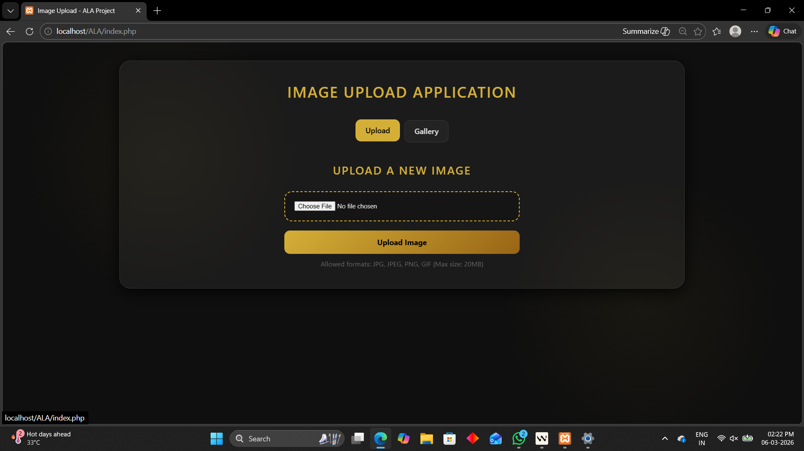
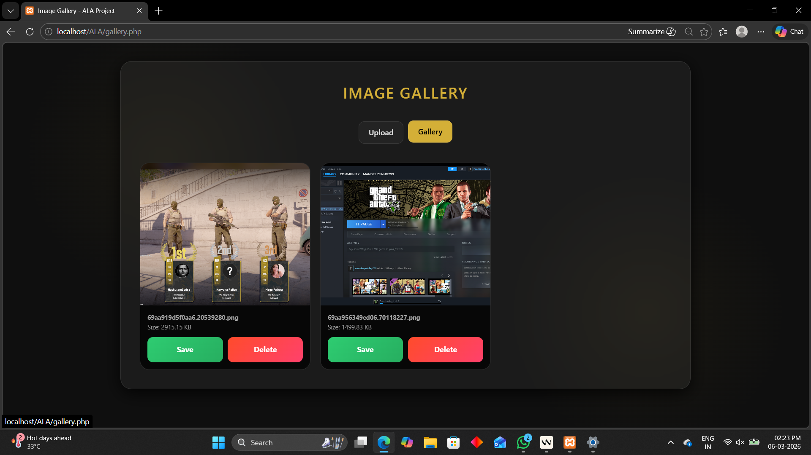
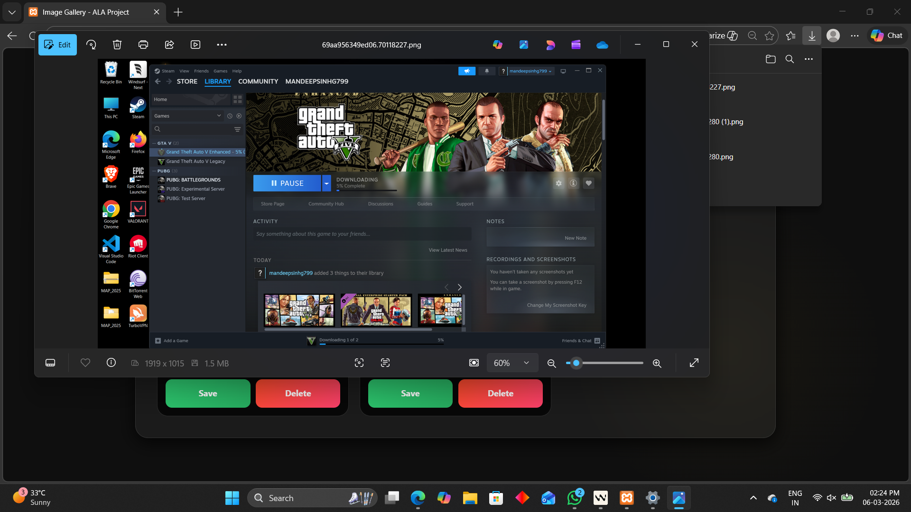

# 📸 Image Upload and Gallery Application (Luxury Edition)

## 🎯 Project Objective
The objective of this project is to provide hands-on experience with **PHP file handling, form processing, validation techniques, and session management** while implementing a **modern, visually appealing user interface**.

This application allows users to **upload images securely and display them in a dynamic gallery**, featuring a **luxury-inspired UI design** with modern web styling techniques.

---
# 📸 Application Screenshots

## 1️⃣ Upload Page
User-friendly interface for uploading images.



---

## 2️⃣ Upload Success
Image successfully uploaded after validation.



---

## 3️⃣ Gallery View
Dynamic gallery displaying uploaded images.




# ✨ Features

## 🎨 Luxury UI / UX
- Dark theme with **gold accents**
- **Glassmorphism design**
- Subtle **grain / particle-style background effects**
- Smooth animations and modern layout

## 📱 Mobile-First Design
- Fully responsive interface
- Works smoothly on **mobile, tablet, and desktop**

## 🔐 Secure Image Upload
- Upload images through a web form
- Validates **file type**
- Validates **file size (max 20MB)**

## 🖼 Dynamic Gallery
- Displays uploaded images automatically
- Images are **sorted alphabetically (A-Z)**

## 📂 File Management
Users can manage uploaded images directly in the gallery.

- Save / Download images
- Delete images from the server
- Confirmation before deletion

## 🧠 Session Tracking
- Tracks **recent uploads during the user session**
- Helps monitor upload activity

---


---

# 📋 Validation Rules

## Allowed File Types
- JPG
- JPEG
- PNG
- GIF

## File Size Limit
Maximum allowed size: **20MB**

## Automatic File Renaming
To avoid duplicate names, uploaded images are renamed using:

```php
uniqid()
```

This ensures each uploaded file has a **unique filename**.

---

# ⚙ Technical Implementation

## PHP File Handling Functions

| Function | Purpose |
|--------|--------|
| `move_uploaded_file()` | Moves uploaded file to uploads directory |
| `unlink()` | Deletes image files |
| `glob()` | Retrieves all uploaded images |
| `filesize()` | Calculates file size |
| `usort()` | Sorts images alphabetically |

---

## Sorting Implementation

Images are sorted alphabetically using:

```php
usort($files, function($a, $b) {
    return strcasecmp($a, $b);
});
```

This ensures images appear in **A-Z order** in the gallery.

---

# 🎨 UI Design Techniques

## Glassmorphism
Uses modern CSS effects such as:

- `backdrop-filter`
- Semi-transparent layers
- Blur effects

## Responsive Layout

Implemented using:

- **CSS Grid**
- **Media Queries**
- **Flexible containers**

This allows the gallery to adapt automatically to different screen sizes.

---

# 📂 Project Structure

```
ALA/
│
├── index.php
├── upload.php
├── gallery.php
├── style.css
│
├── uploads/
│
├── screenshots/
│   ├── upload-page.png
│   ├── upload-success.png
│   └── gallery-view.png
│
└── README.md
```

---

# 🚀 Execution Steps

## 1️⃣ Setup Local Server
Install a local server environment such as:

- XAMPP
- WAMP
- MAMP

## 2️⃣ Place Project in Server Directory

Move the project folder into:

```
htdocs/ALA
```

## 3️⃣ Ensure Upload Folder Exists

Make sure the following folder exists and is writable:

```
uploads/
```

## 4️⃣ Start Apache Server

Start **Apache** from your local server control panel.

## 5️⃣ Open the Application

Open your browser and navigate to:

```
http://localhost/ALA/index.php
```

---

# 🔮 Future Improvements

- Multiple image uploads
- Image preview before upload
- Drag & drop upload
- Database integration (MySQL)
- User authentication system

---

# 👨‍💻 Contributors

Group Members:

- Mandeepsinh Gohil (240905090014)
- Aaditya Sevani (240905090044)
- Rudra Sedani (240905090045)


---


